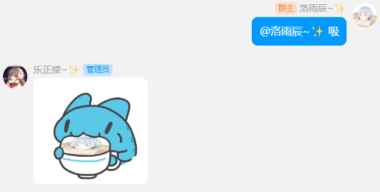
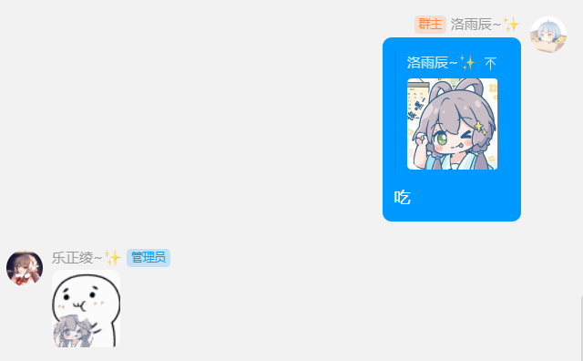
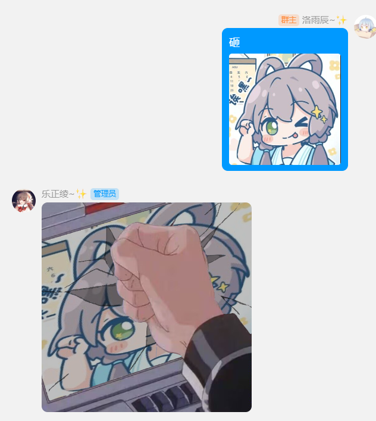
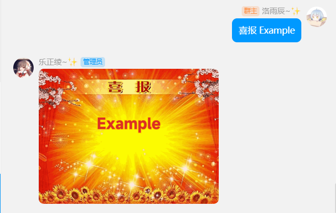

获取可用的图片模板，以合并转发消息的形式发出。

~~目前可用的模板请从群内发送 `pet` 获取。~~

:::info

由于更换登录方案后的兼容性问题，获取模板列表功能暂不可用。

:::

```
acclaim ( 喝彩 欢呼 )
addiction ( 上瘾 毒瘾发作 )
always ( 要我一直 )
anyasuki ( 阿尼亚 喜欢 )
applaud ( 鼓掌 )
ask ( 问问 )
bible ( 圣经 典中典 )
bite ( 啃 咬 )
bocchi ( 波奇 )
brain ( 大脑升级 妈妈生的 )
breakdown ( 惊吓 击穿 )
breast ( 胸 凶 )
capoo_rub ( 咖波蹭 蹭 )
carte ( 佩可莉姆 菜单 单页 )
cast ( 丢 )
center_symmetry ( 中心对称 左上对称 )
certificate ( 喜报 )
chase_train ( 追列车 追火车 )
coupon ( 陪睡 )
cover_face ( 挡 )
crawl ( 爬 )
decent_kiss ( 抱歉 )
dinosaur ( 恐龙 小恐龙 )
distracted ( 注意力 )
divorce ( 离婚申请 离婚协议 离婚 )
dont_touch ( 不要靠近 )
door ( 开门 )
down_symmetry ( 对称 下对称 上下对称 )
eat ( 吃 )
fantasy_time ( 幻想时间 )
fencing ( 击剑 🤺 )
garbage ( 垃圾桶 垃圾 探头 )
genshin_start ( 启动 )
hammer ( 锤 )
hold_sign ( 唐可可 举牌 应援 )
interview ( 采访 )
jiujiu ( 么么 )
join ( 加入 )
karyl_point ( 指 凯露指 )
keep_away ( 远离 )
kick_ball ( 踢球 )
kirby_hammer ( 卡比锤 卡比重锤 重锤 )
kiss ( 亲 热吻 )
kita ( 喜多 展示 )
knock ( 敲 打 )
kurumi ( 胡桃 放大 )
left_down_symmetry ( 中心对称 左下对称 )
leg ( 蹭 )
like ( 永远喜欢 )
loading ( 加载 加载中 )
make_friend ( 加好友 )
marry ( 结婚 )
monad ( 唐可可 拍 单页 )
nano ( 纳米科技 )
need ( 需要 )
no_response ( 无响应 )
osu
painter ( 画 )
pat ( 拍 )
peep ( 泷奈 偷看 )
perfect ( 完美 )
petpet ( 摸 摸头 )
play ( 玩 顶 )
point_tv ( 康纳 电视 )
police ( 警察 )
potato ( 土豆 )
pound ( 捣 )
pr ( 舔屏 )
printing ( 打印 )
punch ( 打拳 )
record ( 唱片 )
remake ( 泥头车 创 重开 )
reverse ( 倒放 )
reward ( 伊蕾娜 赏金 报酬 )
right_down_symmetry ( 中心对称 右下对称 )
right_symmetry ( 对称 右对称 左右对称 )
right_up_symmetry ( 中心对称 右上对称 )
rip_angrily ( 撕 )
rise_dead ( 诈尸 秽土转生 )
roll ( 滚 推 )
rub ( 舔 prpr )
sad_news ( 悲报 )
safe_sense ( 安全感 )
scratch_head ( 挠头 )
screen ( 屏幕 )
show_case ( 展示 )
smash ( 砸 打碎 )
stew ( 炖 )
suck ( 吸 )
support ( 精神支柱 )
sweat ( 流汗 )
symmetry ( 对称 左对称 左右对称 )
teach ( 讲课 敲黑板 )
tear ( 撕 )
thinkwhat ( 想 )
throw ( 扔 )
thump ( 锤 )
tightly ( 黏 )
twist ( 抱 )
up_symmetry ( 对称 上对称 上下对称 )
wallpaper ( 瑞克 壁纸 )
walnutpad ( 胡桃平板 平板 )
watch_tv ( 汤姆 电视 )
worship ( 膜拜 )
yoasobi ( 群青 )
```

## @群成员+关键字



## 回复图片消息+关键字



## 图片+文字



## 关键字+文字



## 关键字+文字+@群成员/回复图片消息/图片

